<div align="center">


<h1>Data Replication Strategies</h1>

<p><strong>The Institutional-Grade Platform for Standardized High-Integrity Data Synchronization, Real-Time Fabric Governance, and Multi-Cloud Movement Ecosystems.</strong></p>

[]()
[]()
[]()

<br/>

> **"Industrializing data movement to automate real-time fabrics."** 
> **Data Replication Strategies** is an enterprise-grade solution designed to provide a secure, measurable, and highly automated foundation for global data synchronization operations. It orchestrates the complex lifecycle of data movement—from continuous change data capture (CDC) and stream buffering to schema translation and unified parity auditing.

</div>

---

## 🏛️ Executive Summary

Fragmented sync scripts and manual ETL batches are strategic operational liabilities; lack of centralized replication orchestration is a primary barrier to organizational real-time analytics and global high availability. Organizations fail to move data efficiently not because of a lack of networks, but because of fragmented transit standards, lack of automated lag validation, and an inability to orchestrate synchronization planes with sub-second precision.

This repository provides the **Replication Intelligence Plane**. It implements a complete **Sync-Strategy-as-Code Framework**, enabling Platform Engineering and Data Architecture teams to manage global movement foundations as first-class citizens. By automating the identification of transit bottlenecks through real-time telemetry analysis and orchestrating the provisioning of secure performance-driven replication policies, we ensure that every organizational data stream—from operational databases to modern lakehouses—is synchronized by default, audited for history, and strictly aligned with institutional RPO/RTO frameworks.

---

## 📐 Architecture Storytelling: Principal Reference Models

### 1. Principal Architecture: Global Data Replication & Synchronization Intelligence Plane
This diagram illustrates the end-to-end flow from transaction capture and multi-cloud orchestration to target loading, parity validation, and institutional replication auditing.

```mermaid
graph LR
    %% Subgraph Definitions
    subgraph DataIngress["Operational Sources & Capture Ingress"]
        direction TB
        Live_DBs["PostgreSQL / SQL Server / Oracle"]
        Log_Miners["Debezium / GoldenGate / CDC"]
        Event_Streams["Application Events / IoT"]
    end

    subgraph IntelligenceEngine["Replication Intelligence Hub"]
        direction TB
        API["FastAPI Sync Gateway"]
        ReplicationOrchestrator["Global Transit & Buffer Hub"]
        Governance_Hub["Compliance & Parity Guardrail Hub"]
        AIOps_Validator["Drift & Lag Analysis Hub"]
    end

    subgraph OperationsPlane["Distributed Movement Ecosystem"]
        direction TB
        ManagedBuffers["Managed Standardized Kafka/Event Hubs"]
        ActiveStreams["Managed Automated Target Writers"]
        ValidationSinks["Managed Data Quality Hubs"]
    end

    subgraph OperationsHub["Institutional Replication Hub"]
        direction TB
        Scorecard["Synchronization Maturity Scorecard"]
        Analytics["Throughput Velocity & Lag Stats"]
        Audit["Forensic Movement Metadata Lake"]
    end

    subgraph DevOps["Sync-Strategy-as-Code Framework"]
        direction TB
        TF["Terraform Transit Modules"]
        DriftBot["Schema & Config Drift Validator"]
        ChatOps["Movement Operations Hub"]
    end

    %% Flow Arrows
    DataIngress -->|1. Stream Changes| API
    API -->|2. Orchestrate Transit| ReplicationOrchestrator
    ReplicationOrchestrator -->|3. Apply Security Guard| Governance_Hub
    Governance_Hub -->|4. Assess Lag| AIOps_Validator
    
    AIOps_Validator -->|5. Execute Load| OperationsPlane
    OperationsPlane -->|6. Notify Status| ChatOps
    API -->|7. Visualize Health| Scorecard
    
    Scorecard -->|8. Track Maturity| Analytics
    Scorecard -->|9. Record Sync| Audit
    
    TF -->|10. Provision Backbone| IntelligenceEngine
    DriftBot -->|11. Inject Parity Risk| ReplicationOrchestrator
    Audit -->|12. Improve Operations| ManagedBuffers

    %% Styling
    classDef ingress fill:#f5f5f5,stroke:#616161,stroke-width:2px;
    classDef intel fill:#e8eaf6,stroke:#1a237e,stroke-width:2px;
    classDef operations fill:#e1f5fe,stroke:#01579b,stroke-width:2px;
    classDef ops fill:#ede7f6,stroke:#311b92,stroke-width:2px;
    classDef devops fill:#e8f5e9,stroke:#1b5e20,stroke-width:2px;

    class DataIngress ingress;
    class IntelligenceEngine intel;
    class OperationsPlane operations;
    class OperationsHub ops;
    class DevOps devops;
```

### 2. The High-Integrity Sync Lifecycle Flow
The continuous path of a replication platform from initial capture (CDC) and buffering (Kafka) to active transformation (schema), loading (target), and institutional forensic auditing (parity).

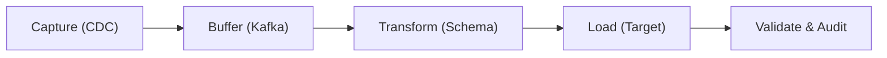

### 3. Distributed Replication Topology
Strategically orchestrating standardized sync engines across operational databases, global cloud regions, and multi-cloud data fabrics, providing a unified institutional view of global data movement health.

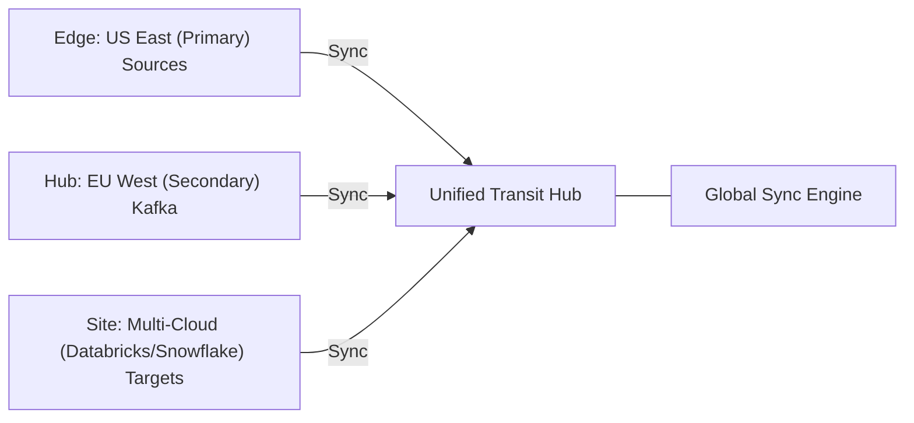

### 4. Replication Governance & High-Trust Data Plane Protection Flow
Executing complex logic for securing the bridge between live transactional systems, transit networks, and analytic targets, ensuring every organizational identity is verified and every data stream is according to institutional standards.

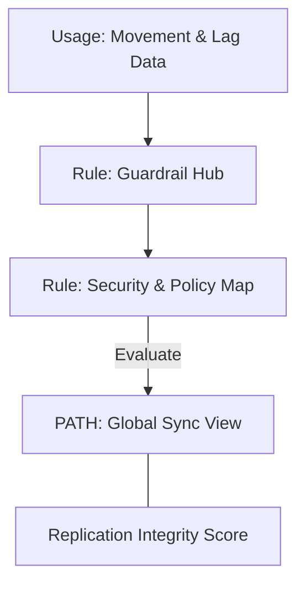

### 5. Multi-Cloud Data Fabric Federation Flow
Automatically managing unified real-time synchronization standards across Azure SQL, AWS RDS, Databricks, and Snowflake, ensuring institutional movement consistency and security boundaries by default.

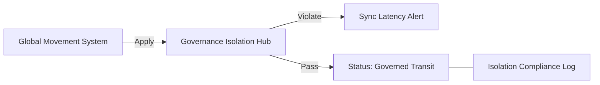

### 6. Encryption & Perimeter Protection Flow (Replication Standard)
Managing the lifecycle of a synchronization request, automatically enforcing institutional TLS 1.3, Private Link routing, and data-in-transit encryption standards as required by security policy, ensuring zero-latency security confidence.

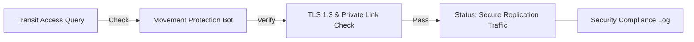

### 7. Institutional Replication Maturity Scorecard
Grading organizational performance based on key indicators: End-to-End Latency, Data Parity Match Rates, and RPO Adherence.

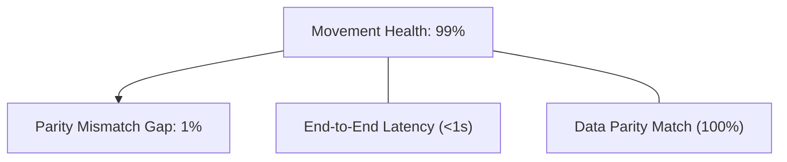

### 8. Identity & RBAC for Synchronization Governance
Managing fine-grained access to transit hubs, provisioning connectors, and audit logs between Data Engineers, Platform Architects, and Compliance Auditors.

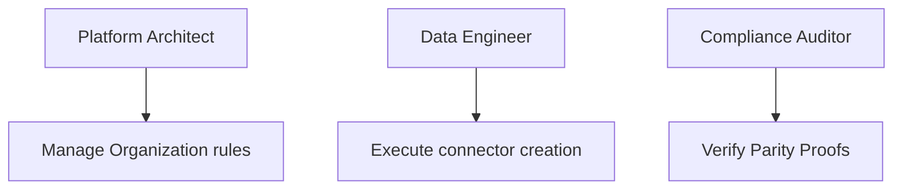

### 9. IaC Deployment: Replication-Strategy-as-Code Framework
Using modular Terraform to deploy and manage the versioned distribution of the transit tracking hubs, policy protection workers, and forensic metadata lakes.

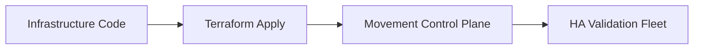

### 10. AIOps Sync Drift & Risk Validation Flow
Using advanced analytics to identify sudden surges in replication lag, schema mismatch errors, suspicious configuration drifts, or unusual throughput changes that could result in institutional risk or bad data.

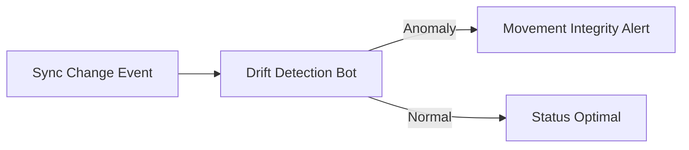

### 11. Metadata Lake for Forensic Sync Audit
Storing long-term records of every sync job configured (metadata), every CDC stream executed, and every error resolution history for institutional record-keeping, compliance auditing, and post-provisioning forensics.

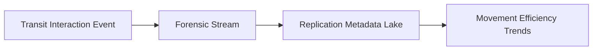

---

## 🏛️ Core Governance Pillars

1.  **Unified Foundation Coordination**: Maximizing velocity by centralizing all synchronization workflows through a single institutional plane.
2.  **Automated Pipeline Provisioning**: Eliminating "manual ETL scripting" scenarios through proactive orchestration and pattern verification.
3.  **Sequential Movement Intelligence**: Ensuring zero-interruption operations through dependency-aware CDC-driven transit engineering.
4.  **Zero-Trust Transit Protection**: Automatically enforcing identity-based access and Private Link evaluation across all replication tiers.
5.  **Autonomous Operations Logic**: Guaranteeing reliability through automated industry-specific latency monitoring runbooks.
6.  **Full Synchronization Auditability**: Immutable recording of every payload captured, translated, and loaded for institutional forensics.

---

## 🛠️ Technical Stack & Implementation

### Replication Engine & APIs
*   **Framework**: Python 3.11+ / FastAPI.
*   **Performance Engine**: Custom Python-based logic for multi-cloud CDC orchestration and real-time transit metrics.
*   **Integrations**: Native connectors for Debezium, Kafka, Azure Event Hubs, Databricks, and Snowflake.
*   **Persistence**: PostgreSQL (Replication Ledger) and Redis (Live Transit State).
*   **Auth Orchestrator**: Federated OIDC/SAML for least-privilege movement management access.

### Governance Dashboard (UI)
*   **Framework**: React 18 / Vite.
*   **Theme**: Dark, Slate, Indigo (Modern high-fidelity movement aesthetic).
*   **Visualization**: D3.js for synchronization topologies and Recharts for lag velocity analytics.

### Infrastructure & DevOps
*   **Runtime**: AWS EKS or Azure Kubernetes Service (AKS) for management plane.
*   **Replication Hub**: Managed event sourcing for immutable transit timeline reconstruction.
*   **IaC**: Modular Terraform for deploying the movement landing zone and validation fleet.

---

## 🏗️ IaC Mapping (Module Structure)

| Module | Purpose | Real Services |
| :--- | :--- | :--- |
| **`infrastructure/movement_hub`** | Central management plane | EKS, PostgreSQL, Redis |
| **`infrastructure/transit_workers`** | Distributed automation workers | Azure, AWS, GCP APIs |
| **`infrastructure/sync_pipes`** | Replication Orchestration Hubs | Webhooks, Kafka |
| **`infrastructure/auditing`** | Forensic transit sinks | S3, Athena, Quicksight |

---

## 🚀 Deployment Guide

### Local Principal Environment
```bash
# Clone the Data Replication Strategies repository
git clone https://github.com/devopstrio/data-replication-strategies.git
cd data-replication-strategies

# Configure environment
cp .env.example .env

# Launch the Movement stack
make init

# Trigger a mock transit request and automated guardrail validation simulation
make simulate-replication
```

Access the Management Portal at `http://localhost:3000`.

---

## 📜 License
Distributed under the MIT License. See `LICENSE` for more information.

---
<div align="center">
  <p>© 2026 Devopstrio. All rights reserved.</p>
</div>
