<div align="center">


<h1>Data Replication Strategies</h1>

<p><strong>The Enterprise Standard for Synchronizing High-Integrity Data Across Multi-Cloud, Hybrid, and Global Estates</strong></p>

[]()
[]()
[]()
[]()

<br/>

> **"Data in motion is the lifeblood of the modern enterprise."** 
> Data Replication Strategies is a flagship platform designed to demonstrate production-ready patterns, automation, and performance models for replicating data across Azure, AWS, GCP, and hybrid environments.

</div>

---

## 🏛️ Executive Summary

**Data Replication Strategies** is a flagship repository designed for Chief Data Officers (CDOs), Platform Engineering leads, and Architects. In the era of global operations and real-time AI, data cannot be stagnant. It must flow between regions, clouds, and platforms with sub-second latency and absolute integrity.

This platform provides an industrialized approach to **Data Synchronization**, delivering production-ready **Replication Engines**, **CDC Workflows**, **Bidirectional Sync Models**, and **Executive Lag Dashboards**. It supports **Databricks**, **Snowflake**, **Fabric**, and legacy SQL environments, enabling teams to build resilient, high-performance data fabrics.

---

## 💡 Why Replication Matters

Replication is the "Connectivity" layer of the data estate:
- **High Availability**: Ensuring business continuity via real-time regional failover.
- **Global Performance**: Serving data close to users to minimize application latency.
- **Hybrid Modernization**: Bridging on-premises legacy systems with cloud-native lakehouses.
- **Analytics Segregation**: Moving operational data to analytics platforms without impacting production performance.

---

## 🚀 Business Outcomes

### 🎯 Strategic Replication Impact
- **Sub-Second RPO/RTO**: Achieving near-zero data loss and minimal downtime for mission-critical systems.
- **Multi-Cloud Resilience**: Decoupling the data layer from a single cloud provider for risk mitigation.
- **Operational Efficiency**: Automating the complex task of schema evolution and conflict resolution.
- **Cost Optimization**: Using intelligent batching and compression to minimize cross-region egress costs.

---

## 🏗️ Technical Stack

| Layer | Technology | Rationale |
|---|---|---|
| **Replication Engine** | Python, Kafka, Debezium | Industrial-grade stream processing and change data capture. |
| **Control Plane** | FastAPI | High-performance API for orchestration and monitoring. |
| **Frontend** | React 18, Vite | Premium portal for executive lag tracking and topology mapping. |
| **IaC Foundation** | Terraform | Multi-cloud infrastructure consistency and automation. |
| **Database** | PostgreSQL | Centralized repository for replication metadata and state. |
| **Observability** | Prometheus / Grafana | Real-time monitoring of replication lag and throughput. |

---

## 📐 Architecture Storytelling: 60+ Diagrams

### 1. Executive High-Level Architecture
The holistic vision of the enterprise data replication journey.

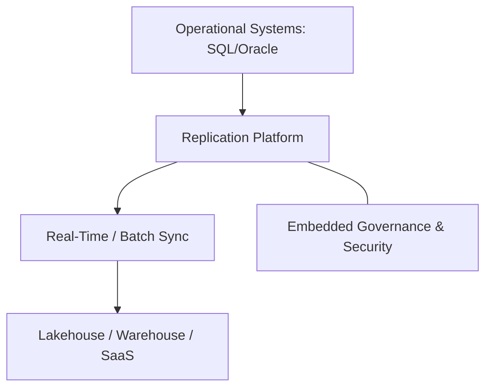

### 2. Detailed Component Topology
The internal service boundaries and management layers of the platform.

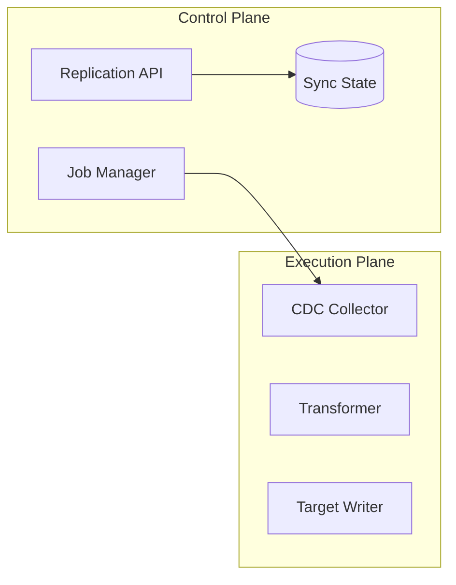

### 3. Frontend to Backend Request Path
Tracing a "Provision New Replication Link" request through the stack.

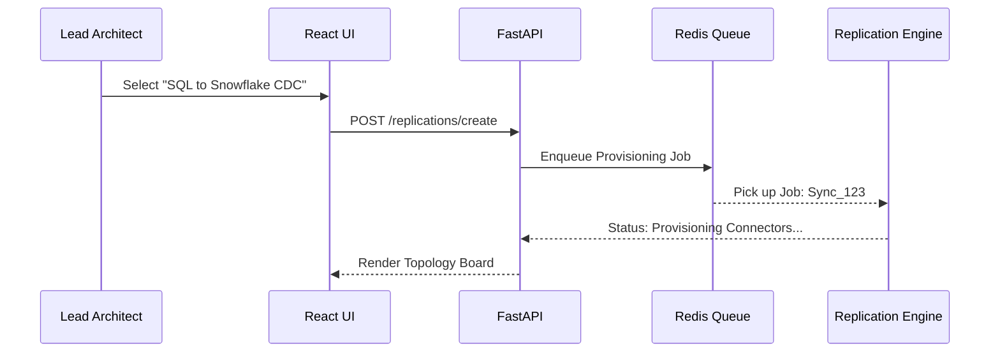

### 4. Replication Control Plane
The "Brain" of the framework managing cross-cloud sync definitions.

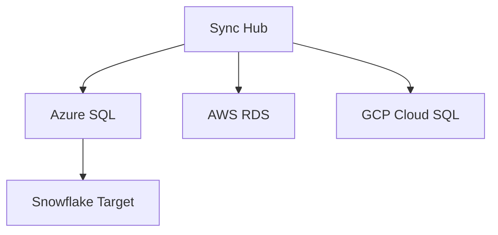

### 5. Multi-Cloud Topology
Synchronizing data standards across diverse cloud and on-prem estates.

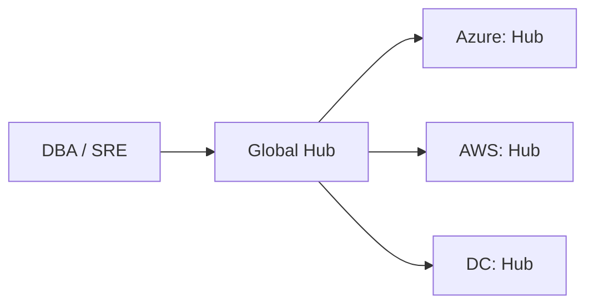

### 6. Regional Deployment Model
Hosting replication workers close to the source for performance.

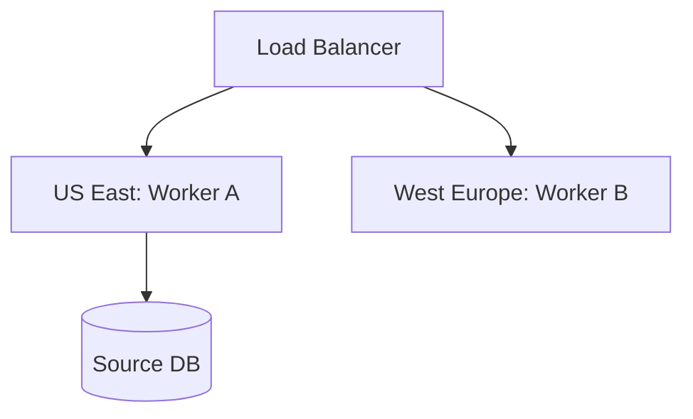

### 7. DR Failover Model
Ensuring replication continuity during regional cloud outages.

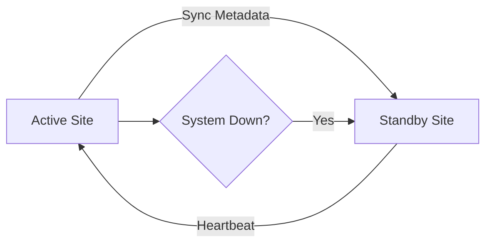

### 8. API Gateway Architecture
Securing and throttling the entry point for replication orchestration.

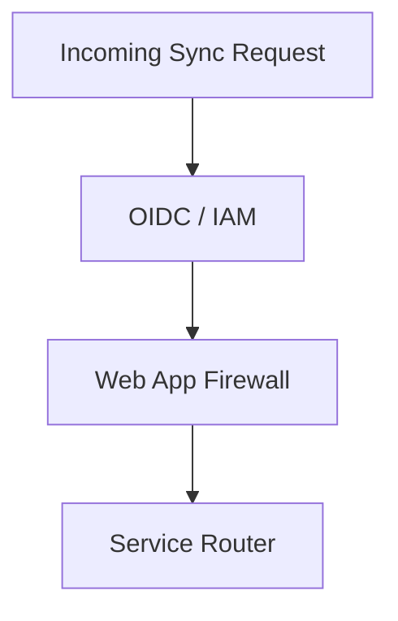

### 9. Queue Worker Architecture
Managing long-running sync and validation tasks at scale.

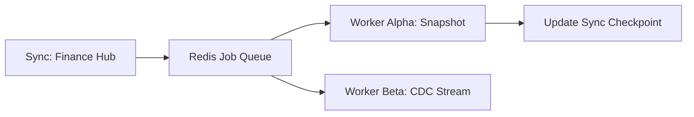

### 10. Dashboard Analytics Flow
How raw sync telemetry becomes executive lag scorecards.

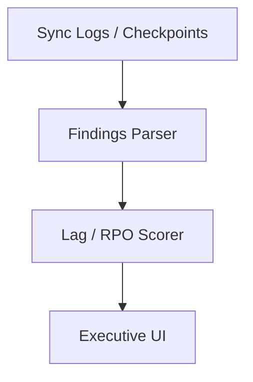

### 11. Full Load Replication Workflow
Initial synchronization of massive datasets.

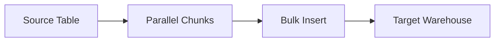

### 12. Incremental Sync Model
Capturing changes based on watermark columns.

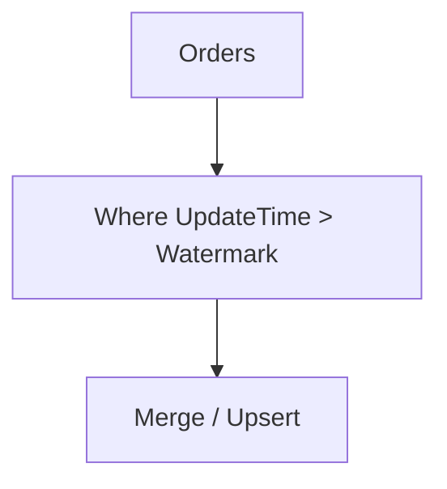

### 13. CDC Log-Based Capture Flow
Low-latency capture from database transaction logs.

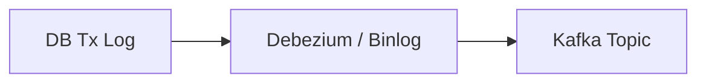

### 14. Snapshot + CDC Handoff
Seemless transition from historical load to real-time sync.

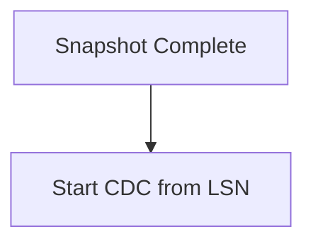

### 15. Bidirectional Sync Model
Keeping two systems in sync with conflict detection.

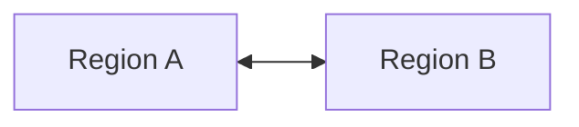

### 16. Hub-and-spoke Replication
Centralizing data from multiple distributed sources.

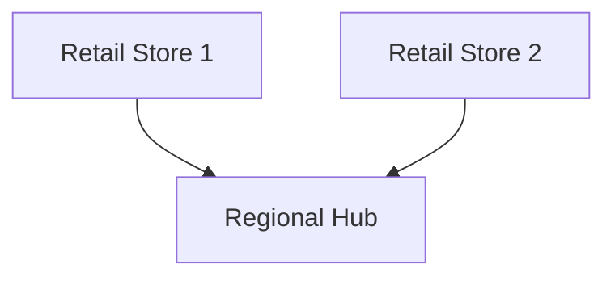

### 17. Mesh Replication Topology
Highly resilient peer-to-peer data distribution.

```mermaid
graph LR
    N1[Node 1] -- N2[Node 2]
    N2 -- N3[Node 3]
    N3 -- N1
```

### 18. Conflict Resolution Workflow
Managing "Last-Writer-Wins" and other strategies.

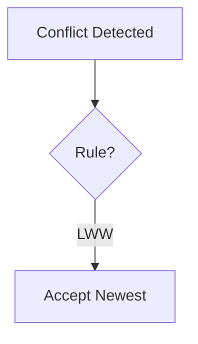

### 19. Idempotent Replay Model
Ensuring failures don't cause data duplication.

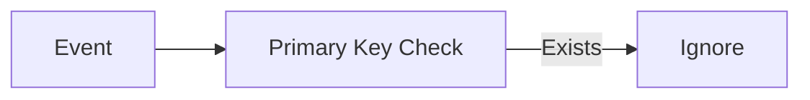

### 20. Checkpoint Recovery Flow
Resuming replication from the last known good position.

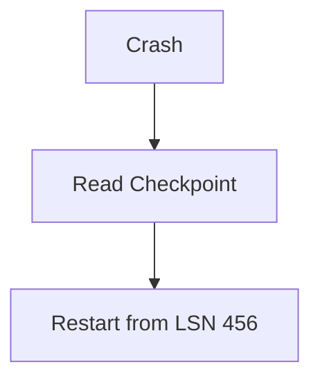

### 21. SQL Server to PostgreSQL Flow
Heterogeneous replication from enterprise to open-source.

```mermaid
graph LR
    SQL[MSSQL] --> CDC[Connector]
    CDC --> PG[Postgres]
```

### 22. Oracle Replication Model
Handling heavy enterprise workloads via GoldenGate or custom miners.

```mermaid
graph TD
    Ora[Oracle] --> Miner[Log Miner]
    Miner --> Kafka[Stream]
```

### 23. MySQL Multi-Region Replication
Scaling read-replicas across the globe.

```mermaid
graph LR
    Master[US East] --> Replica1[West Europe]
    Master --> Replica2[Asia Pac]
```

### 24. PostgreSQL Logical Replication
Granular, table-level synchronization.

```mermaid
graph TD
    Pub[Publisher] --> Sub[Subscriber]
```

### 25. SQL to Snowflake Pipeline
Feeding the cloud data warehouse with sub-second latency.

```mermaid
graph LR
    SQL[On-Prem] --> Snowpipe[Snowflake Ingest]
```

### 26. SQL to Databricks Flow
Real-time bronze layer hydration.

```mermaid
graph TD
    SQL[Source] --> Delta[Delta Lake]
```

### 27. SQL to BigQuery Model
Streaming insights into GCP.

```mermaid
graph LR
    SQL[Source] --> BQ[BigQuery Write API]
```

### 28. SQL to Synapse Workflow
Integrating with Azure's enterprise analytics.

```mermaid
graph TD
    SQL[Source] --> Syn[Synapse SQL Pool]
```

### 29. SQL to Fabric Model
Feeding the next-generation Microsoft data estate.

```mermaid
graph LR
    SQL[Source] --> OneLake[Fabric OneLake]
```

### 30. Heterogeneous Coexistence Topology
Managing a complex mix of legacy and modern engines.

```mermaid
graph LR
    Legacy[Mainframe] --> Mod[Modern Lakehouse]
```

### 31. S3 to ADLS Replication
Cross-cloud object storage synchronization.

```mermaid
graph LR
    S3[AWS S3] --> Sync[Data Movement]
    Sync --> ADLS[Azure Data Lake]
```

### 32. ADLS to GCS Workflow
Synchronizing data between Azure and GCP.

```mermaid
graph TD
    ADLS[Source] --> GCS[GCP Bucket]
```

### 33. File Share to Object Storage
Modernizing on-prem file assets.

```mermaid
graph LR
    SMB[SMB Share] --> Blob[Azure Blob]
```

### 34. Kafka Topic Mirroring
Synchronizing event streams across clusters.

```mermaid
graph TD
    Src[Cluster A] --> MM2[MirrorMaker 2]
    MM2 --> Target[Cluster B]
```

### 35. Event Hub Replication Model
Azure-native streaming distribution.

```mermaid
graph LR
    EH1[Hub A] --> EH2[Hub B]
```

### 36. Streaming CDC to Lakehouse
Directly feeding Delta or Iceberg from logs.

```mermaid
graph TD
    Log[Log] --> Stream[Spark Streaming]
    Stream --> Iceberg[Iceberg Table]
```

### 37. Batch File Transfer Model
Standardized managed file transfer (MFT) patterns.

```mermaid
graph LR
    FTP[SFTP] --> Copy[Batch Job]
```

### 38. Compression / Partition Strategy
Optimizing for performance and cost.

```mermaid
graph TD
    Raw[Raw Data] --> Parquet[Compressed Parquet]
```

### 39. Metadata Sync Workflow
Ensuring schema changes follow the data.

```mermaid
graph LR
    Schema[Source Schema] --> Meta[Metadata Service]
```

### 40. Data Product Publishing Flow
Replicating certified assets to consumers.

```mermaid
graph TD
    Cert[Certified Asset] --> Pub[Publisher]
    Pub --> Cons[Consumer Spoke]
```

### 41. Throughput Tuning Model
Maximizing MB/s across the wire.

```mermaid
graph LR
    Pipe[Network Pipe] --> Buffer[Tuned Buffers]
```

### 42. Parallel Worker Scaling
Processing large tables with multiple threads.

```mermaid
graph TD
    Table[Huge Table] --> W1[Worker 1]
    Table --> W2[Worker 2]
```

### 43. Backpressure Handling Flow
Preventing system exhaustion during spikes.

```mermaid
graph LR
    Spike[Traffic Spike] --> Throttle[Rate Limiter]
```

### 44. Retry / Dead-letter Model
Handling transient and permanent errors.

```mermaid
graph TD
    Fail[Error] --> DLQ[Dead Letter Queue]
```

### 45. Replication Lag Alerting
Monitoring the "Health" of the movement.

```mermaid
graph LR
    Lag[Lag: 10s] --> Alert[SRE Notification]
```

### 46. RPO Score Calculation
Measuring data loss risk in real-time.

```mermaid
graph TD
    Last[Last Sync] --> RPO[Score: 99.8%]
```

### 47. Cutover Readiness Workflow
Planning for final migration switches.

```mermaid
graph LR
    Check[Sync Check] --> Ready[Switch Ready]
```

### 48. DR Switchover Model
Orchestrating the transition to secondary sites.

```mermaid
graph TD
    Primary[Site A] --> Switch[Cutover]
    Switch --> Secondary[Site B]
```

### 49. SLA Monitoring Flow
Visualizing performance against targets.

```mermaid
graph LR
    Metric[Sync Rate] --> Dashboard[SLA Gauge]
```

### 50. Cost per GB Transfer Model
Tracking the ROI of data movement.

```mermaid
graph TD
    Bytes[GBs] --> Cost[$0.02 / GB]
```

### 51. OIDC / SSO Auth Flow
Secure portal access.

```mermaid
graph LR
    User[User] --> Entra[Entra ID / Okta]
```

### 52. RBAC / ABAC Model
Governing who can define sync jobs.

```mermaid
graph TD
    Role[Data Eng] --> Perm[Write Sync]
```

### 53. Secrets Management Flow
Securing source/target credentials.

```mermaid
graph LR
    App[Engine] --> Vault[Vault / KV]
```

### 54. Encryption in Transit Workflow
Protecting data across the wire.

```mermaid
graph TD
    Data[Data] --> TLS[TLS 1.2 / 1.3]
```

### 55. Audit Logging Architecture
Tracking every configuration change.

```mermaid
graph LR
    Change[Edit Job] --> Log[(Audit Log)]
```

### 56. Metrics Pipeline
Monitoring the performance of the replication stack.

```mermaid
graph TD
    Engine[Engine] --> Prom[Prometheus]
```

### 57. Logging Architecture
Centralized engine records.

```mermaid
graph LR
    Pod[Replication Pod] --> Loki[Loki]
```

### 58. Tracing Model
Tracing sync requests across services.

```mermaid
graph TD
    Portal[UI] --> Trace[OTel Trace]
```

### 59. Release Pipeline Workflow
Continuous delivery of the platform.

```mermaid
graph LR
    Git[Code] --> GHA[Deploy]
```

### 60. Change Governance Workflow
Governing updates to critical sync jobs.

```mermaid
graph TD
    Edit[Edit P1 Job] --> Appr[CAB Approval]
```

---

## 🔬 Data Replication Methodology

### 1. The Replication Pillars
Our platform is built on four core pillars:
- **Integrity**: Guaranteeing that source and target are identical at the sync point.
- **Latency**: Minimizing the time gap between source commit and target arrival.
- **Efficiency**: Optimizing for compute and network bandwidth costs.
- **Visibility**: Providing real-time monitoring of lag and movement health.

### 2. Conflict Resolution Strategies
- **Last-Writer-Wins (LWW)**: Simple, time-based resolution.
- **Source-Wins**: Trusting the primary system of record.
- **Custom-Logic**: Implementing business rules for merging records.

---

## 🚦 Getting Started

### 1. Prerequisites
- **Terraform** (v1.5+).
- **Docker Desktop**.
- **Azure/AWS/GCP CLI** configured.

### 2. Local Setup
```bash
# Clone the repository
git clone https://github.com/Devopstrio/data-replication-strategies.git
cd data-replication-strategies

# Start the Replication Control Plane
docker-compose up --build
```
Access the Replication Portal at `http://localhost:3000`.

---

## 🛡️ Governance & Security
- **Data Sovereignty**: Built-in support for regional landing zones and residency compliance.
- **Immutable Auditability**: All administrative actions and data access events are logged to an immutable store.
- **Zero-Trust Movement**: All data traffic occurs within private networks (Private Link / VNet Peering), ensuring no exposure to the public internet.

---
<sub>&copy; 2026 Devopstrio &mdash; Engineering the Future of Industrialized Data Movement.</sub>
